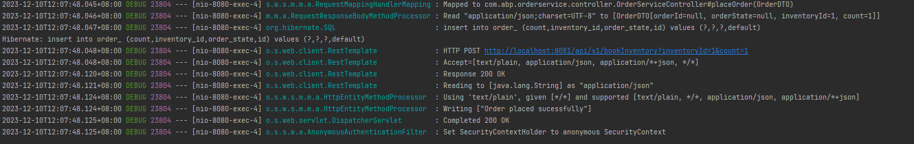
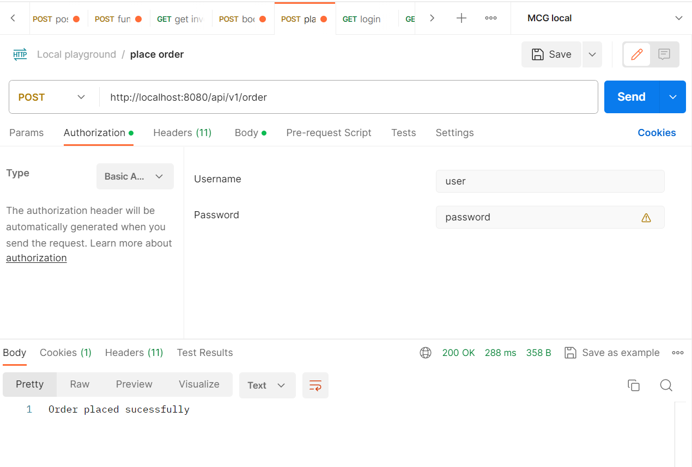
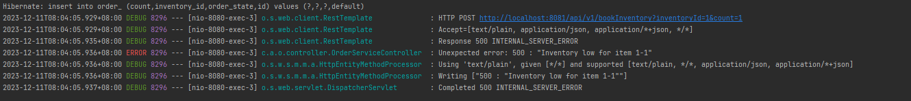
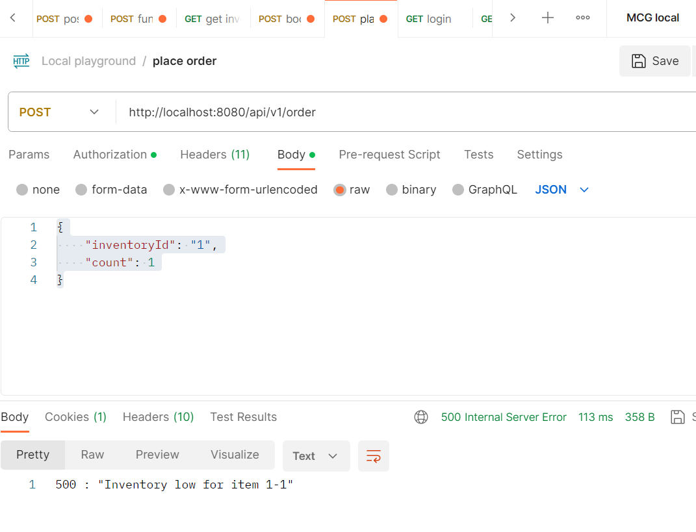

# Order Service
Order service allows us to place and create order, order should go through different order state until order fulfilment. Libraries used included spring security, spring rest template, hibernate, mapstruct, lombok

## Guides
* after started the service, login with username: user password: password
* send a post call to http://localhost:8080/api/v1/order with request body {
  "inventoryId": "1",
  "count": 1
  } to create an order
* inventory service will revert with successful/failure with the book
* more detail documented in OrderServiceImpl.processOrder()
* 

## Improvement
* Model can definitely be improved as orderLineItems that handle multiple items per order also other details needed for payment
* As code base expand, refactors with generics or functional style where applicable
* Many of the code improvement are being listed down as TODO in various part of the source code
* For db, we definitely need an actual RDBMS, and we will need to fine tune hibernate, change ddl-auto to none, explore jpa buddy for schema validation
* Include flyway/liquidbase for db upgrade
* REplace rest template with web client
* Externalise application properties 
* Consider distributed caching as project grows
* Spring cloud sleuth for distributed tracing, spring cloud config for configuration
* Write relevant unit test and integration test, consider test container
* Further, can consider service registry/discovery and spring cloud gateway for rate limiting/routing etc. Failure scenario with hytrix or other pattern

### random notes
* Order id should be in UUID, can be handled explicitly by random UUID. In the case of duplicate, simply re-generate random and reinsert the order.
* URL in rest client call needed to be tidy up into application.yml
* Had to name Order "Order_" due to H2 limitation

* 

